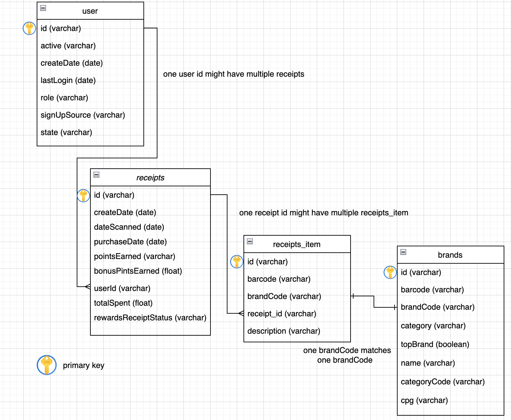

## First: Review Existing Unstructured Data and Diagram a New Structured Relational Data Model
Three sample data files: users, receipts, and brands. 
After reviewing their structures, 
for users, I simply converted it to csv,
for receipts, I separated **rewardsReceiptItemList** from receipts file and created another data file named after 'receipts_item' for **rewardsReceiptItemList**. 
for brands, I simply converted it to csv. 

### relational database
1. users table uses id to link userId in receipts table. (one to many)
2. receipts table uses id to link receipt_id in receipts_item table. (one to many)
3. brands table uses brandCode to link brandCode in receipts_item table. (one to one) 

### relational diagram

## Second: Write a query that directly answers a predetermined question from a business stakeholder
Link: [this is SQL query](./query_totalSpent.sql)     

SQL Query Result: 
1. Pepsi, Kraft, KNORR, Kleenex, and Doritos are 5 brands that have the top 5 total spend among users who were created during the past 6 months (2020-09-01 to 2021-02-28). Among these top 5 brands, only Doritos is the top brand. 
2. Pepsi is the number 1 brand with total spend. It is not a top brand. It belongs to Beverage category. The average purchase item amount of Pepsi is 268.93 and the total purchase item amount of Pepsi is 19,901. The average spend on Pepsi is $1,065.82 and the total spend on Pepsi is $78,870.85. 
3. Five top 5 brands have diverse categories: beverages, dairy, grocery, household, and snacks. However, they are related to basic commodities or daily necessities.  

## Third: Evaluate Data Quality Issues in the Data Provided
Link: [this is Python code](./Data_Quality_Issue.ipynb)

## Fourth: Communicate with Stakeholders
Hello xxx, 

I hope this email finds you well. My name is Enning, a data analyst. I am working on a project about using some data files to develop insights. The data files I am using now are Users, Receipts, and Brands. While I am working on this project, I noticed that there are some data quality issues and I would like to discuss it with you. 

First, there are some missing values in each data set. I used the Python pandas package to find the number of missing values and see if it can be fixed by building some data entry rules. For example, the name and topBrand column in the Brand file should not be blank because I assume they are manually entered by staff. Therefore, in this case, we can create rules to the data entry system to require all columns to be filled in before submitting the data entry.  

Second, there is some duplicate data. Take the Brand file for example again, when I used the groupby function to see the number of brandCode, there were some duplicate brandCodes. This may result in some confusion when doing data analysis. In this case, we can create a complete brand list and use automatic matching function to put brandCode. 

Third, there is some inaccurate data. When I looked into duplicate brandCode, I noticed that there are different topBrand results under the same brandCode. I wonder if they are two different brands or merely data entry mistakes. 

To better analyze the data, I also have some questions for you. The first one is whether brandCode in the Brand file can be referred to brandCode in the Receipt file. The second question is when the data file was created. By understanding the date, I can be more confident to analyze past 6 months receipts and user data. 

For further analysis, I also have some scaling concerns. The data format now is unstructured, so I transformed data files to structured data by Python and converted it from json to csv. I recommend the team can use structured data schema, so it is more convenient to scale up the analysis. Another recommendation is to separate “rewardsReceiptItemList” from receipts, and use receipt_id to link both tables. Therefore, there should be cleaner data schema and analysts can have deeper analysis on reward receipt items

I would like to discuss further plans with you! Feel free to reach out to me. I am looking forward to hearing from you. 

Best regards,
En-Ning Chiang. 

## Note: Convert unstructured data to structured data
[this is Python code](./)
This is file about how I converted unstructured data to structured data. 
